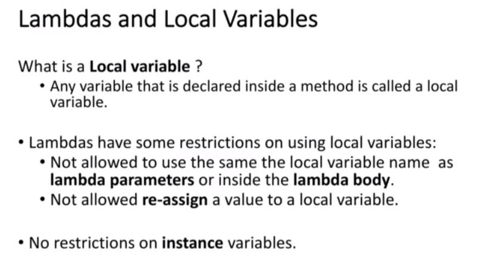
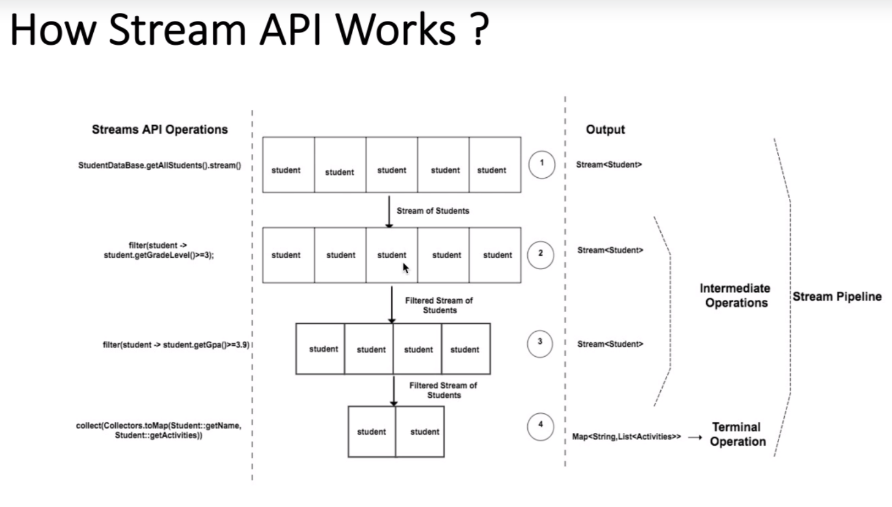
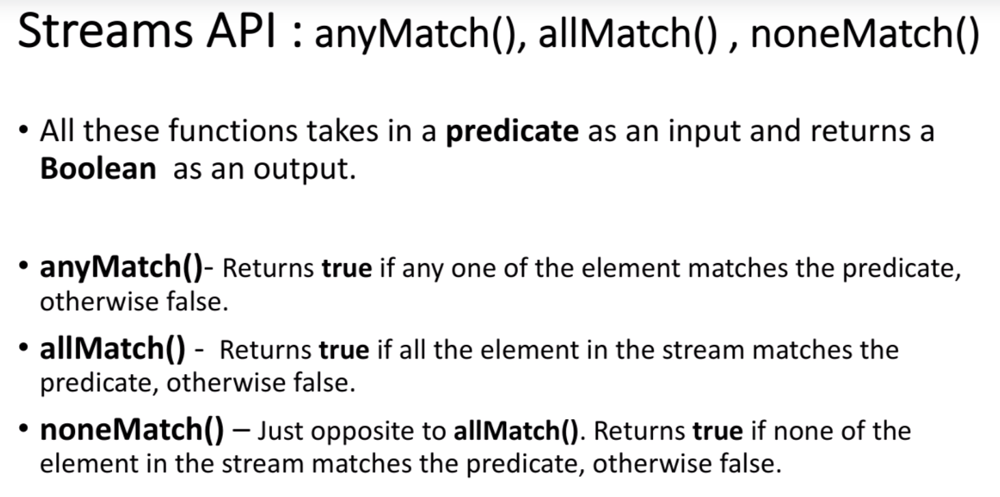

Lambda: Is equivalent to method, without a name. It is also referred as Anonymous function. It can also be asigned to a variable and passed around.
```
() -> {}
```

Lambda is mainly used to implement Functioanl Interfaces (SAM). Functioanl Interfaces is a an interface which has exactly 1 abstract method

@FunctionalInterface

New Functioanl Interfaces introduces in Java 8:

COnsumer
Predicate
Function 
Supplier


Consumer:
Consumer has one method called "accept" [java.util.function]
It accept an input and perform some operation on that: void accept(T t);
Except the "accept" method which needs to be implemented, there are few default methods as well like andThen() etc.

BiConsumer: It accepts 2 inputs

Predicate: boolean test (T t);
default method of predicate: and() or() negate(). negate() reverse the boolean resposne i.e. if response is true, it will return false and vice versa.
BiPredicate: BiPredicate:boolean test(T t, U u);

Function: Implemnet a functionaloty and assgn that functionaloty to a variable
R apply(T t);
It has 2 default methods compose() and andThen()

BiFunction:
```

public interface BiFunction<T, U, R> {
    R apply(T t, U u);
}
```

IT has only one default methof called andThen()


UnaryOperator: 
```

public interface UnaryOperator<T> extends Function<T, T> {
    static <T> UnaryOperator<T> identity() {
        return t -> t;
    }
}
```


So, we have Function already, so under what scenario, we should use UnaryOperator?
Ans: We have a scenario, where input and output is same type,.


public interface BinaryOperator<T> extends BiFunction<T,T,T> {}
i.e. 2 input and 1 output are of same type;
This BinaryOperator has 2 static methods minBy() and maxBy() - Note these 2 methods are NOT default methods

So, if the input and output types are same, then we can use UnaryOperator and BinaryOperator instead of Function

So FUnctional Interface can have multiple metods, one has to be abstract methods, others are defaut methos... (need to check of it allow multiple non abstract method which are not default method) 

Supplier: This is exactly opposite of Consumer
```
public interface Supplier<T> {
    T get();
}
```

Functional Interface:
Shortcut of writing Lambda extressions

ClassName::instance-methodName
ClassName::static-methodName
ClassName::methodName

Lambda expressions referring to a method directly.

Using Lambda:
```
Function<String, String> l = s -> s.toUpperCase();
```

It can rewrite as:
```
Function<String, String> l = String::toUpperCase;
```


Where method ref cannot used:
Where we wrote our own logic. Like,

```
Predicate<Student> predicate = s -> s.getGeadeLevel() >= 3;
```

If we want to use methd ref here, is possible... if we put move that entire logic under a method...

```
private static boolean m1(Student p) {
        return p.getGradeLevel() >= 3;
}

Predicate<Student> predicate1 = EPredicateExample::m1;
```

Constructor Reference: This needs to have empty constructor
```
Supplier<Student> studentSupplier = Student::new;
Student student = Student::new; // conpilation error
```


Lambda Variables:


effectively final: Helps to do build concurrency application


Advantage of effectively final:

```
public void localVariableMultithreading() {
    boolean run = true;
    executor.execute(() -> {
        while (run) {
            // do operation
        }
    });
    
    run = false;
}
```

While this looks innocent, it has the insidious problem of “visibility”. Recall that each thread gets its own stack, and so how do we ensure that our while loop sees the change to the run variable in the other stack? The answer in other contexts could be using synchronized blocks or the volatile keyword.


stream(), parallelStream()


If collect() not there, none of the operations will be executed in stream() i.e. lazy appoeoach (i.e. until the terminal operation which is collect() is not invoked, nothing will be kicked off)

We can travers the stream only once:
```
Stream<String> namesStream = names.stream();
namesStream.forEach(System.out::println);
namesStream.forEach(System.out::println);
```

Above will give error -> stream has already been closed.

How to debug Lambda: Using peek()

```
list1.stream().filter(1st filter).filter(2nd filter).collect(Collector.toList) -> for every element from list1, it will first apply 1st filter, then apply 2nd filter, then do the same for next element.
```


map()
flatmap()
distinct()
count()
sorted(): natural sort
Sort with comparator: .sorted(Comparator.comparing(Student::getName))
filter()
reduce(): terminal operation as line collect(). Used to reduce the amt of contents of a stream to a single value.
2 params: 1st: initial val, 2nd is BinaryOperator<T>
limit()
skip(): skips the "n" number of elements from the stream


allMatch(): 
anyMatch()
noneMatch()


findFirst(): Returns first element in the stream
findAny(): Returns the first encountered element in the stream

Stream short-circuiting operations:
like if(a && b) -> if a is false, b will not be evaluated. This is called short-circuiting 
Below are the methods does not iterate whole stream() to get you the result:
limit(), findFirst(), findAny(), anyMatch(), allMatch(), noneMatch()

of(), generate(), iterate(): (These are factory methods)

of(): Creates a stream of certain values pased to this method.
Eg: Stream<String> s = Stream.of("cc", "zz", "ll");

iterate(), generate(): Used to create infinite Streams.
Eg, 
Stream.iterate(1, x-> x*2)
Stream.generate(<Supplier>)

Numeric Streams:
IntStream()
LongStream()
DoubleStream()

IntStream.range(1, 50): 1 to 49 it will consider
IntStream.rangeClosed(1, 50): 1 to 50 it will consider

Similar LongStream... DoubleStream does not support range() and rangeClosed(), but there is a wayout
IntStream.range(1, 50).asDoubleStream().forEach(v -> sout(...));

IntStream: sum(), max(), min(), average(), boxing(), unboxing/mapToInt()
mapToObj() -> convert each element numeric stream to some Object
mapToLong(), 
mapToDouble()

Terminal Operations:
collect(), forEach(), min(), max(), reduce() etc
joining(): Collectors perform String concatination. It has 3 overloaded versions.
counting()
mapping()
minBy()
maxBy()
summingInt()
averagingInt()
groupBy()

collectingAndThen()
PartitioningBy(): also kind of groupBy()


 

 